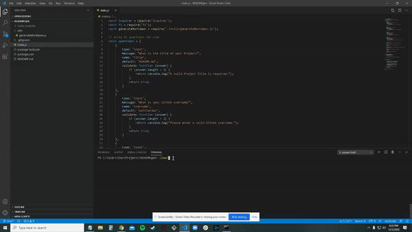

# README.md Generator

  
  ## Description 
  
  Who likes writing out and formating README's? I sure don't! Here is a simple README generator to make your life a little easier.
  ## Table of Contents
  * [Installation](#installation)
  * [Usage](#usage)
  * [Questions](#questions)

  ## Installation
  
  To create your own README file: run `npm install` to install [`inquirer`](https://www.npmjs.com/package/inquirer) which will prompt you for inputs from the command line.

  Application can be ran by typing `node index.js` in the terminal. 
  
  ## Usage 

  Run the application in the terminal using `node index.js`. 

  You will be prompted to answer questions that make up the diffent sections of the to be generated README file.

  After all the questions have been answered your README document will be generated.

  [video](https://drive.google.com/file/d/1b39hkhdN-bMC2XRmd2GxFouEFzwljgV_/preview) on how to use the thing if you still not quite sure. 
  
  ## Questions?
  Questions? please contact me:
 
  GitHub: [wattierdan](https://github.com/wattierdan)
  
  Email: wattierdan@live.com
  